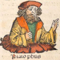

# The Nuremberg Chronicle 1493: Transcriptions

>„ […] The Nuremberg Chronicle […] is one of the most important and most beautiful books of the incunabula era. Both the Latin version […] and the German version […] were printed in the offices of Anton Koberger who owned one of Europe's largest printing houses of the period. […] Following medieval traditions, the author divides the history of mankind into seven ages: the first age extended from the creation to the deluge; the second from the deluge to the birth of Abraham, the third to the kingdom of David; the fourth covered the period […] to the Babylonian Captivity; the fifth to the birth of Christ; the sixth […] from the birth of Christ to the present; and the seventh dealt with the arrival of the Antichrist and the Last Judgment.", (Bernstein, [2002](http://www.jstor.org/stable/1262133), p. 1422).
>
Annotated transcriptions from the *Nuremberg Chronicle*, fol. Ir to  VIIr (Tab. 1), in *Latin*,  `Fol_1r_Lat`-`Fol_7r_Lat` (Schedel, [1493](https://daten.digitale-sammlungen.de/~db/0003/bsb00034024/images/index.html?id=00034024)), *Early New High German*, ENHG, `Fol_1r_ENHG`-`Fol_7r_ENHG` (Schedel and Alt, [1493](https://web.archive.org/web/20161003154613/http://ora-web.swkk.de/digimo_online/digimo.entry?source=digimo.Digitalisat_anzeigen&a_id=4218), [1496](https://doi.org/10.3931/e-rara-69075), res.) and from the *English* translation by Hadavas ([2023](https://digital.library.wisc.edu/1711.dl/3SXNV3NHBQLFQ8J)) in comparison, `Fol_1r_cmp`-`Fol_7r_cmp`.  
Where the division of the paragraphs *P* in the comparative presentations is based on the ENHG version.

Table 1. Headings and contents of fol. Ir to fol. VIIr (Schedel, [1493](https://daten.digitale-sammlungen.de/~db/0003/bsb00034024/images/index.html?id=00034024)).
~~~
page			content

Foliu[m] I	recto	Epitoma operu[m] sex dieru[m] de mu[n]di fabrica Prologus
Folium   II	recto	
		verso	De opere prime diei.
Foliu[m] III	recto	De opere secunde diei.
		verso	De opere tercie diei.
Foliu[m] IIII	recto	De opere quarte diei.
		verso	De opere quinte diei.
Foliu[m] V	recto	De opere sexte diei.
		verso	De sanctificatione septime diei
Foliu[m] VI	recto	Queda[m] circa spera[m] planetaru[m] et orbiu[m] declara[n]da.
		verso	Prima etas mundi
Folium   VII	recto	Etas prima mundi
~~~

Primarily influenced by Conrad Celtis (1459-1476), Martin Behaim (1459-1507), Johannes Müller (Regiomontanus, 1436-1476) and Johannes Werner (1468-1522), is the text mainly based on the *Supplementum Chronicarum* by Foresti ([1492](https://books.google.com/books?id=ei9TruMbYCkC&printsec=frontcover)):

>„ […] collectors of incunabula have often been attracted by the magnificent illustrations […] Brought to the general attention of English collectors in 1724 by Thomas Hearne […] ", (Cushing Duniway, [1941]([http://www.jstor.org/stable/24296510), p. 17).

Figure 1. Animated illustrations from the *Nuremberg Chronicle*, fol. Iv to Vv (Schedel, [1493](https://daten.digitale-sammlungen.de/~db/0003/bsb00034024/images/index.html?id=00034024)).

In this context see also Haitz ([1899](https://books.google.com/books?id=bhdEtQEACAAJ)), Schnieper ([1950](https://doi.org/10.5169/SEALS-387655)), Sladeczek ([1965](https://doi.org/10.11588/diglit.37607)), Rücker ([1988](https://books.google.com/books?id=CiujnAEACAAJ)) or Green ([2003](https://books.google.com/books?id=tXC8HgAACAAJ)), facsimile and translations are given by Schedel ([2010](http://www.smithandpress.com/Our_Books.html)), Zellmann-Roher and Hadavas ([2011a](https://www.abebooks.com/9780983140726/Liber-Chronicarum-Translation-Volume-Nuremberg-0983140723/plp), [b](https://www.abebooks.com/9780983140719/Liber-Chronicarum-Translation-Volume-Nuremberg-0983140715/plp), [2012a](https://ocul-gue.alma.exlibrisgroup.com/discovery/fulldisplay?docid=alma991033686926707371&context=L&vid=01OCUL_GUE:GUELPH&search_scope=OCULDiscoveryNetwork&adaptor=Local%20Search%20Engine&tab=OCULDiscoveryNetwork&query=creator,equals,%20Zellmann-Rohrer,%20Michael,AND&mode=advanced&offset=0&lang=en), [b](https://www.gettextbooks.com/isbn/9780983140740/), res.); for a (full) raw transcripton of the ENHG text see Wikisource contributors ([2025](https://de.wikisource.org/wiki/Kategorie:Schedelsche_Weltchronik)), c.f. given [tables](https://github.com/Schrausser/The_Nuremberg_Chronicle_1493_Tables) (fol. Ir to VIIr).

On the interpretation of Latin abbreviations see e.g. Martin ([1910](https://archive.org/details/recordinterprete00martuoft)), Lindsay ([1915](http://www.archive.org/details/cu31924021587716)) or Cappelli ([1928](https://archive.org/details/LexiconAbbreviaturarum)). For ENHG dictionaries see  Goebel et al. ([1989](https://www.degruyter.com/serial/fnhdwb-b/html?lang=en#volumes)).

## References

Bernstein, E. (2002). Review. *Renaissance Quarterly 55* (4): 1422–24. [http://www.jstor.org/stable/1262133](http://www.jstor.org/stable/1262133)

Cappelli, A. (1928). *Lexicon Abbreviaturarum: Wörterbuch lateinischer und italienscher Abkürzungen*. 2nd ed. Leipzig: Verlagsbuchhandlung von J. J. Weber. [https://archive.org/details/LexiconAbbreviaturarum](https://archive.org/details/LexiconAbbreviaturarum)

Cushing Duniway, D. (1941). A Study of the Nuremberg Chronicle. *The Papers of the Bibliographical Society of America 35* (1): 17–34. [http://www.jstor.org/stable/24296510](http://www.jstor.org/stable/24296510)

Foresti, G. F. (1492). *Supplementum Chronicarum*. Novariensis: Bernardinus Rizus. [https://books.google.com/books?id=ei9TruMbYCkC&printsec=frontcover](https://books.google.com/books?id=ei9TruMbYCkC&printsec=frontcover)

Goebel, U., Lobenstein-Reichmann, A., & Reichmann, O. (1989). *Frühneuhochdeutsches Wörterbuch*, 12 Volumes. Berlin, Boston: De Gruyter. [https://www.degruyter.com/serial/fnhdwb-b/html?lang=en#volumes](https://www.degruyter.com/serial/fnhdwb-b/html?lang=en#volumes)

Green, J. P. (2003). *The Nuremberg Chronicle and Its Readers: The Reception of Hartmann Schedel’s Liber Cronicarum*. Illinois: University of Illinois at Urbana-Champaign. [https://books.google.com/books?id=tXC8HgAACAAJ](https://books.google.com/books?id=tXC8HgAACAAJ)

Hadavas, K. (2023). *First English edition of the Nuremberg chronicle : being the Liber chronicarum of Dr. Hartmann Schedel*. Edited by Hadavas, K. UW–Madison TEI edition. Madison, Wisconsin: University of Wisconsin–Madison Libraries. [https://digital.library.wisc.edu/1711.dl/3SXNV3NHBQLFQ8J](https://digital.library.wisc.edu/1711.dl/3SXNV3NHBQLFQ8J)

Haitz, M. (1899). *Hartmann Schedel’s Weltchronik*. München: Lüneburg. [https://books.google.com/books?id=bhdEtQEACAAJ](https://books.google.com/books?id=bhdEtQEACAAJ)

Lindsay, W. M. (1915). *Notae Latinae: An Account of Abbreviation in Latin Mss. Of the Early Minuscule Period (c. 700-850)*. Cambridge: at the University Press. [http://www.archive.org/details/cu31924021587716](http://www.archive.org/details/cu31924021587716)

Martin, C. T. (1910). *The Record Interpreter : A Collection of Abbreviations, Latin Words and Names Used in English Historical Manuscripts and Records*. 2nd ed. London: Stevens and sons, limited. [https://archive.org/details/recordinterprete00martuoft](https://archive.org/details/recordinterprete00martuoft)

Rücker, E. (1988). *Hartmann Schedels Weltchronik: das grösste Buchunternehmen der Dürer-Zeit : mit einem Katalog der Städteansichten*. München: Prestel. [https://books.google.com/books?id=CiujnAEACAAJ](https://books.google.com/books?id=CiujnAEACAAJ)

Schedel, H. (1493). *Liber chronicarum cum figuris et ymagibus ab inicio mundi*. Nuremberge: Antonius Koberger. [https://daten.digitale-sammlungen.de/~db/0003/bsb00034024/images/index.html?id=00034024](https://daten.digitale-sammlungen.de/~db/0003/bsb00034024/images/index.html?id=00034024)

———. (2010). *Liber Chronicarum Reference Edition*. Facsimile. Boston, MA: Selim S. Nahas Press. [http://www.smithandpress.com/Our_Books.html](http://www.smithandpress.com/Our_Books.html)

Schedel, H., & Alt, G. (tr.). (1493). *Buch der Chroniken und geschichten mit figure und pildnüssen von anbegin der welt bis auf diese unsere Zeit*. Nuremberge: Antonius Koberger.
[https://web.archive.org/web/20161003154613](https://web.archive.org/web/20161003154613/http://ora-web.swkk.de/digimo_online/digimo.entry?source=digimo.Digitalisat_anzeigen&a_id=4218)

———. (1496). *Das buch Der croniken unnd geschichten mit figuren und pildnussen von Anbeginn der welt bis auff diese unsere Zeyt*. Augsburg: Johann Schönsperger. [https://doi.org/10.3931/e-rara-69075](https://doi.org/10.3931/e-rara-69075)

Schnieper, X. (1950). Die Schedelsche Weltchronik: eine Einführung und Würdigung. In *Mitteilungsblatt Der Schweizerischen Bibliophilen-Gesellschaft*, 7:84–104. 3-4. Basel: Schweizerische Bibliophilen-Gesellschaft. [https://doi.org/10.5169/SEALS-387655](https://doi.org/10.5169/SEALS-387655)

Sladeczek, L. (1965). *Albrecht Dürer und die Illustrationen zur Schedelchronik*. 1st ed. Vol. 342. Studien Zur Deutschen Kunstgeschichte. Baden-Baden/Strasbourg: Verlag Heitz GmbH. [https://doi.org/10.11588/diglit.37607](https://doi.org/10.11588/diglit.37607)

Wikisource contributors. (2025). *Schedelsche Weltchronik.* Retrieved 2025 from de.wikisource.org. [https://de.wikisource.org/wiki/Kategorie:Schedelsche_Weltchronik](https://de.wikisource.org/wiki/Kategorie:Schedelsche_Weltchronik)

Zellmann-Roher, M., & Hadavas, C. (2011a). *Liber Chronicarum Translation*. 1st ed. Vol. 1. Boston, MA: Selim S. Nahas Press. [https://www.abebooks.com/9780983140726](https://www.abebooks.com/9780983140726/Liber-Chronicarum-Translation-Volume-Nuremberg-0983140723/plp)

———. (2011b). *Liber Chronicarum Translation*. 1st ed. Vol. 2. Boston, MA: Selim S. Nahas Press. [https://www.abebooks.com/9780983140719](https://www.abebooks.com/9780983140719/Liber-Chronicarum-Translation-Volume-Nuremberg-0983140715/plp)

———. (2012a). *Liber Chronicarum Translation*. 1st ed. Vol. 3. Boston, MA: Selim S. Nahas Press. [https://ocul-gue.alma.exlibrisgroup.com/discovery/fulldisplay](https://ocul-gue.alma.exlibrisgroup.com/discovery/fulldisplay?docid=alma991033686926707371&context=L&vid=01OCUL_GUE:GUELPH&search_scope=OCULDiscoveryNetwork&adaptor=Local%20Search%20Engine&tab=OCULDiscoveryNetwork&query=creator,equals,%20Zellmann-Rohrer,%20Michael,AND&mode=advanced&offset=0&lang=en)

———. (2012b). *Liber Chronicarum Translation*. 1st ed. Vol. 4. Boston, MA: Selim S. Nahas Press. [https://www.gettextbooks.com/isbn/9780983140740/](https://www.gettextbooks.com/isbn/9780983140740/)
